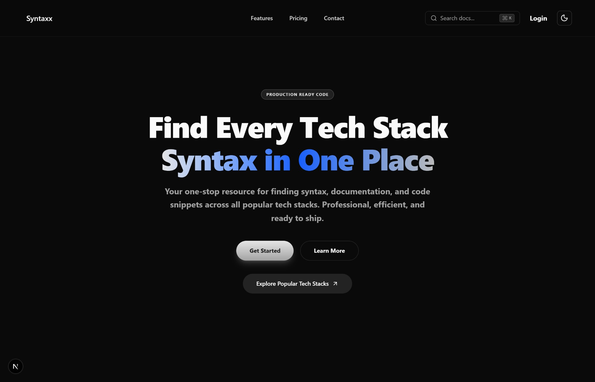
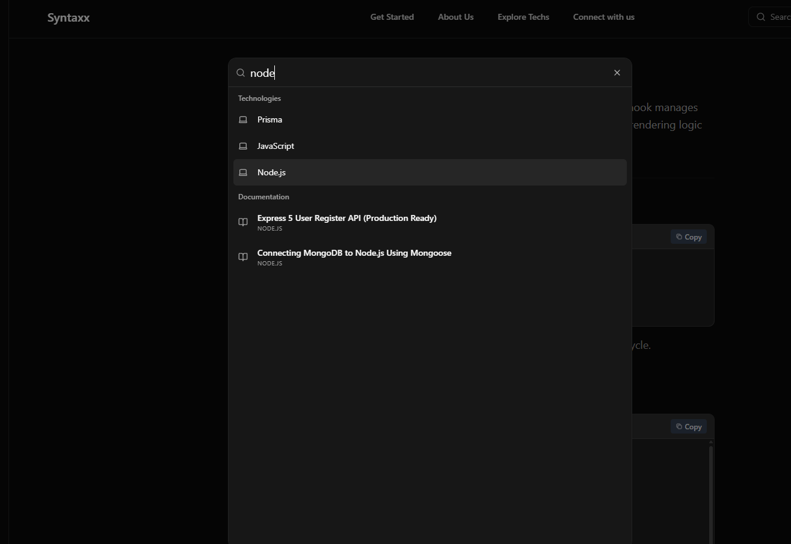
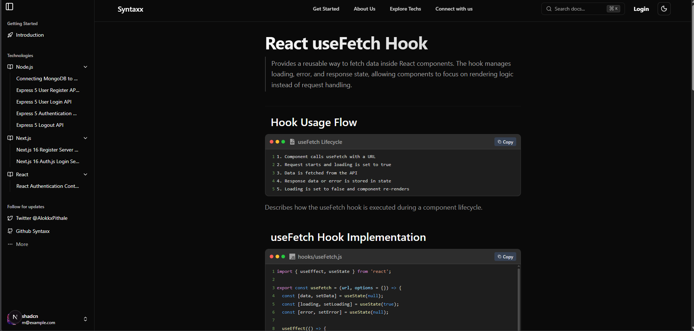

# Syntaxx

<div align="center">


**Your one-stop resource for finding syntax, documentation, and code snippets across all popular tech stacks. Professional, efficient, and ready to ship.**

[Features](#features) • [Tech Stack](#tech-stack) • [Getting Started](#getting-started) • [Usage Examples](#usage-examples)

</div>

---

## 📋 Project Title & Description

**Syntaxx** is a comprehensive documentation platform that provides developers with production-ready code snippets, syntax references, and detailed documentation for popular tech stacks. Whether you're working with React, Next.js, Node.js, or any other technology, Syntaxx helps you find the exact syntax and implementation patterns you need—fast.

### Key Features

- 🔍 **Powerful Search**: Instantly search across technologies and documentation with intelligent filtering
- 📚 **Comprehensive Documentation**: Detailed guides with code snippets for each tech stack
- ⚡ **Production-Ready Code**: All code examples are tested and ready for production use
- 🎨 **Modern UI**: Beautiful, responsive interface with dark mode support
- 🚀 **Fast Performance**: Redis caching for lightning-fast responses
- 🔗 **Related Content**: Discover related documentation based on tags and tech stacks

---

## 🏠 Home Page



The home page features a clean, modern design with:
- Hero section highlighting the core value proposition
- Quick access to popular tech stacks
- Search functionality with keyboard shortcuts (⌘K)
- Call-to-action buttons for getting started

---

## 🔍 Search Functionality



The search feature provides:
- **Real-time search** across technologies and documentation
- **Categorized results** separating technologies from documentation
- **Quick navigation** with keyboard shortcuts
- **Smart filtering** to find exactly what you need

---

## 📖 Documentation Page



Each documentation page includes:
- **Detailed explanations** of concepts and implementations
- **Code snippets** with syntax highlighting
- **Copy-to-clipboard** functionality for easy code reuse
- **Related documentation** suggestions
- **Navigation sidebar** for easy browsing

---

## 🛠 Tech Stack

Syntaxx is built with modern, production-ready technologies:

### Frontend
- **[Next.js 16.1.6](https://nextjs.org/)** - React framework with App Router
- **[React 19.2.3](https://react.dev/)** - UI library
- **[TypeScript 5.0](https://www.typescriptlang.org/)** - Type safety
- **[Tailwind CSS 4](https://tailwindcss.com/)** - Utility-first CSS
- **[Framer Motion](https://www.framer.com/motion/)** - Animations
- **[Radix UI](https://www.radix-ui.com/)** - Accessible component primitives

### Backend & Database
- **[Prisma 5.22.0](https://www.prisma.io/)** - Next-generation ORM
- **[PostgreSQL](https://www.postgresql.org/)** - Relational database (via Neon)
- **[Redis](https://redis.io/)** - Caching layer (via Upstash)

### Deployment & Infrastructure
- **[Vercel](https://vercel.com/)** - Hosting and deployment platform
- **[Neon](https://neon.tech/)** - Serverless PostgreSQL
- **[Upstash](https://upstash.com/)** - Serverless Redis

### Additional Tools
- **[Zod](https://zod.dev/)** - Schema validation
- **[React Syntax Highlighter](https://github.com/react-syntax-highlighter/react-syntax-highlighter)** - Code highlighting
- **[Lucide React](https://lucide.dev/)** - Icon library

---

## 🚀 Getting Started

### Prerequisites

- Node.js 18+ or Bun
- npm, yarn, pnpm, or bun

### Installation

1. **Clone the repository**
   ```bash
   git clone https://github.com/yourusername/syntaxx.git
   cd syntaxx
   ```

2. **Install dependencies**
   ```bash
   npm install
   # or
   pnpm install
   # or
   bun install
   ```

3. **Set up the database**
   ```bash
   # Generate Prisma Client
   npx prisma generate
   
   # Run migrations
   npx prisma migrate dev
   
   # Seed the database (optional)
   npm run seed
   ```

4. **Start the development server**
   ```bash
   npm run dev
   # or
   pnpm dev
   # or
   bun dev
   ```

5. **Open your browser**
   
   Navigate to [http://localhost:3000](http://localhost:3000)

---

## 💡 Usage Examples

### Searching for Documentation

Use the search bar (⌘K) to quickly find technologies and documentation:

1. **Search by Technology**: Type the name of a technology (e.g., "React", "Node.js")
2. **Search by Topic**: Search for specific concepts or features
3. **Browse Results**: View categorized results for technologies and documentation

### Exploring Tech Stacks

Navigate through different tech stacks from the home page:

- Click on any technology card to view all available documentation
- Browse code snippets organized by category
- Copy code examples directly to your clipboard

### Viewing Documentation

Each documentation page provides:

- **Detailed explanations** of concepts and best practices
- **Production-ready code snippets** with syntax highlighting
- **Related documentation** suggestions based on tags
- **Easy navigation** through the sidebar menu

---

## 🧪 Development

### Available Scripts

```bash
# Development
npm run dev          # Start development server

# Production
npm run build        # Build for production
npm run start        # Start production server

# Database
npx prisma generate  # Generate Prisma Client
npx prisma migrate   # Run database migrations
npx prisma studio    # Open Prisma Studio
npm run seed         # Seed the database

# Linting
npm run lint         # Run ESLint
```

---

## 🚢 Deployment

### Deploy to Vercel

1. Push your code to GitHub
2. Import your repository in [Vercel](https://vercel.com)
3. Configure your project settings
4. Deploy!

Vercel will automatically:
- Detect Next.js
- Run `npm run build`
- Deploy your application

---

## 🤝 Contributing

Contributions are welcome! Please feel free to submit a Pull Request.

1. Fork the repository
2. Create your feature branch (`git checkout -b feature/AmazingFeature`)
3. Commit your changes (`git commit -m 'Add some AmazingFeature'`)
4. Push to the branch (`git push origin feature/AmazingFeature`)
5. Open a Pull Request

---

## 📝 License

This project is licensed under the MIT License - see the LICENSE file for details.

---

## 🙏 Acknowledgments

- Built with [Next.js](https://nextjs.org/)
- Database powered by [Neon](https://neon.tech/)
- Caching with [Upstash Redis](https://upstash.com/)
- Deployed on [Vercel](https://vercel.com/)

---

<div align="center">

**Made with ❤️ for developers**

[Website](https://syntaxx.vercel.app) • [Documentation](#) • [Issues](https://github.com/yourusername/syntaxx/issues)

</div>
